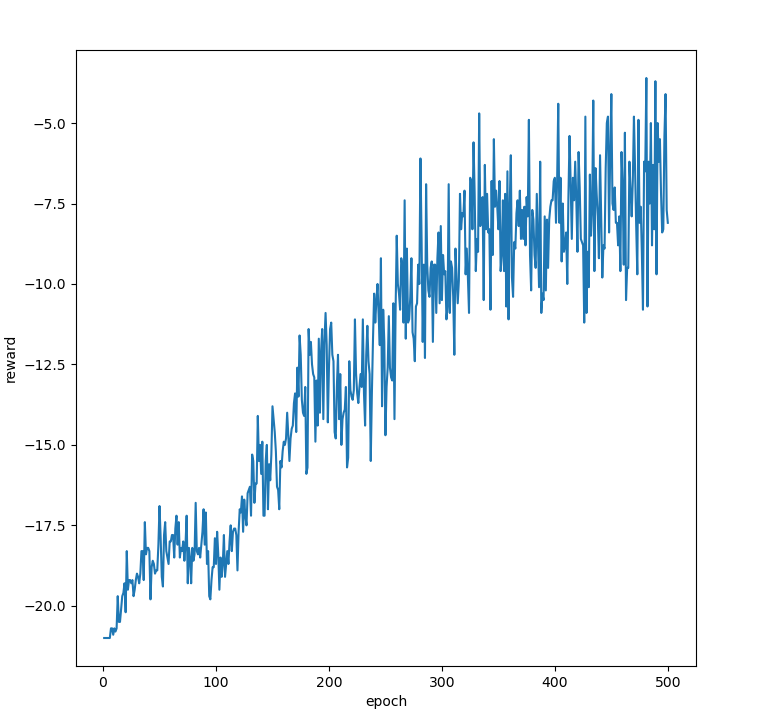
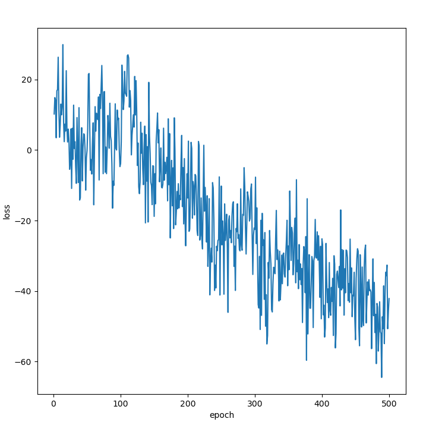

REINFORCE is the simplest deep RL algorithm, yet achieves cool results. I've written a simple module to train neural nets to play OpenAI gym games using the algorithm. To train a net for a particular game...

- change `env_name` in `net.py` to desired env name
- change the NN architecture, the state pre-process function `phi`, and `frames` in `net.py`
- change hyperparameters in `train.py`
- then run `train.py` to train the NN
- run `play.py` to see how the NN fares
- set `render` arg of `tau` to `True` if you want the game rendered
- set it to `False` (default) if you just want to return episode return

Here is `Pong-v0` before training...

after training for 500 epochs (2 hrs 42 min)...

Had I chosen the right hyperparameters, it'd have learned faster, but this is okay. We just want to see if it learns anything or not, and here the agent has learned a decent strategy - striking the ball quickly by the tip of the paddle so it (ball) flies off before the opponent can reach it.

The return for an episode is the difference b/w agent score and opp score. Here are the returns for 500 epochs...

and the loss...

